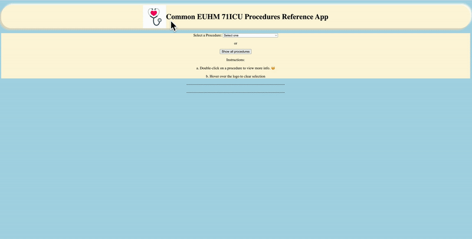

# Title
Common EUHM 71ICU Procedures Reference App

# Introduction
The Common EUHM 71ICU Procedures Reference App is a sample application that provides information regarding the most common or most performed procedures by nurses at 71ICU in Emory University Hospital Midtown. 

Here is a list of the features and multiple ways to navigate through the app:

1. Using the dropdown menu to show the procedure's steps, indications, and contraindications. 
2. Clicking the "Show all procedures" button will show a list of all procedures.
3. After clicking the "Show all procedures" button, the user has the option to double-click on a procedure, and it will show the user more useful information, such as steps, indications, and contraindications of the procedure. 
4. Hovering over thelogo will clear your current selection to be ready for choosing another procedure. 

# Demo
Here is a preview of how to navigate through the app:

